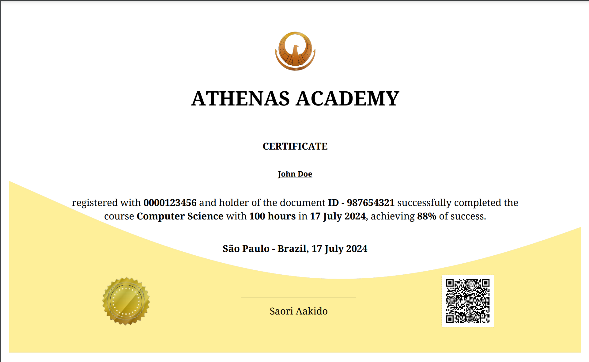

# *Athenas Academy*

# Certificate

Project developed in C# with .NET Core 8 to demonstrate skills in technologies and concepts such as SOLID, Clean Code, scalability techniques, code performance, and software architecture.

The project is a comprehensive solution for managing academic certificates at the fictitious Athenas Academy. It provides a RESTful API as the entry point for creating and retrieving certificates, an event-driven architecture integrated with messaging services, local storage with cloud expansion capabilities, and automated tests to ensure software quality.

## 1. Technologies

### 1.1. Docker

Docker is used to containerize different services of the application, facilitating development, distribution, and execution across various environments.

#### 1.1.1. Postgres

Postgres is the database used by the project to store certificate data and event process records in a relational manner.

#### 1.1.2. MinIO

MinIO is an S3-compatible object storage service from AWS used for storing certificate files and other documents.

#### 1.1.3. RabbitMQ

RabbitMQ is a messaging platform used for asynchronous communication between project services.

## 2. Wkhtmltopdf

Wkhtmltopdf is a command-line tool used to convert HTML to PDF, essential for generating certificates in PDF format.

### 2.1. Wkhtmltopdf - Linux

To install Wkhtmltopdf on Linux, follow these steps:

```bash
sudo apt-get update
sudo apt-get install -y wkhtmltopdf
```

### 2.2. Wkhtmltopdf - Windows

To install Wkhtmltopdf on Windows, follow these steps:

1. Download the installer from [Wkhtmltopdf Downloads](https://wkhtmltopdf.org/downloads.html).
2. Run the installer and follow the on-screen instructions.

## 3. Projects

### 3.1. Core

The **AthenasAcademy.Certificate.Core** project contains business logic, core services used by the application, and repositories for external data access.

### 3.2. EventBus

The **AthenasAcademy.Certificate.EventBus** project provides an abstract component for event-driven architecture implementation. RabbitMQ was chosen as the message broker.

### 3.3. API

The **AthenasAcademy.Certificate.API** project exposes RESTful endpoints for interacting with certificate services. It includes pre-implemented JWT-based authentication and authorization.

### 3.4. Handling

The **AthenasAcademy.Certificate.Handling** project orchestrates events from the message broker, using subscription managers, parallel scheduling, and background jobs for efficient event handling.

### 3.5. Domain

The **AthenasAcademy.Certificate.Domain** project contains entities and data models used within the application domain, including request and response contracts.

### 3.6. Test

The **AthenasAcademy.Certificate.Test** project contains automated tests to ensure the quality and correct functioning of the application.

## 4. Configuration

### 4.1. Docker Compose

Docker Compose orchestrates the different services into containers. Configuration is available in the `./deploy/docker-compose.yml` file.

### 4.2. MinIO

- **Image**: `minio/minio`
- **Container Name**: `file-manager`
- **Environment Variables**:
  - `MINIO_ROOT_USER`: MinIO root user name.
  - `MINIO_ROOT_PASSWORD`: MinIO root user password.
  - `MINIO_HTTP_TRACE`: Disabled to avoid logging HTTP traces.
- **Command**: Starts the MinIO server with console access on port `9001`.
- **Volumes**:
  - `minio:/data`: Volume for data persistence.
- **Ports**:
  - `9000:9000`: Port for client access.
  - `9001:9001`: Port for user interface access (console).

### 4.3. Postgres

- **Image**: `postgres:latest`
- **Container Name**: `db-certificate`
- **Environment Variables**:
  - `POSTGRES_DB`: Name of the database to be created.
  - `POSTGRES_USER`: PostgreSQL username.
  - `POSTGRES_PASSWORD`: PostgreSQL user password.
- **Volumes**:
  - `postgres:/data`: Volume for data persistence.
  - `./certificate-create.sql:/docker-entrypoint-initdb.d/certificate-create.sql`: SQL script for initializing the database.
- **Ports**:
  - `5433:5432`: Port for client access.

### 4.4. RabbitMQ

- **Image**: `rabbitmq:3-management`
- **Container Name**: `event-bus`
- **Environment Variables**:
  - `RABBITMQ_DEFAULT_USER`: Default RabbitMQ username.
  - `RABBITMQ_DEFAULT_PASS`: Default RabbitMQ password.
  - `RABBITMQ_LOAD_DEFINITIONS`: Path to definitions file.
- **Volumes**:
  - `rabbitmq:/data`: Volume for data persistence.
  - `./definitions.json:/etc/rabbitmq/definitions.json`: RabbitMQ definitions file.
  - `./rabbitmq.conf:/etc/rabbitmq/rabbitmq.conf`: RabbitMQ configuration file.
- **Command**: Enables management, shovel, and shovel management plugins and starts RabbitMQ server.
- **Ports**:
  - `5672:5672`: Port for client communication.
  - `15672:15672`: Port for management interface access.

### 4.5. Wkhtmltopdf - Linux

1. **Update and Install Dependencies:**

   ```bash
   apt-get update && apt-get install -y libgdiplus libc6-dev wkhtmltopdf xvfb
   ```

   - `libgdiplus`: Library for GDI+ compatibility on Linux.
   - `libc6-dev`: glibc development package, required for compilation.
   - `wkhtmltopdf`: Command-line tool for converting HTML to PDF.
   - `xvfb`: X Virtual Framebuffer, used to simulate a graphical display.

2. **Execution Script Configuration:**

   ```bash
   printf '#!/bin/bash\nxvfb-run -a --server-args="-screen 0, 1024x768x24" /usr/bin/wkhtmltopdf -q $*' > /usr/bin/wkhtmltopdf.sh
   ```

   - Creates a `wkhtmltopdf.sh` script that executes `wkhtmltopdf` within `xvfb-run`, ensuring the process has access to a virtual "screen."

3. **Permissions and Symbolic Links:**

   ```bash
   chmod a+x /usr/bin/wkhtmltopdf.sh
   ln -s /usr/bin/wkhtmltopdf.sh /usr/local/bin/wkhtmltopdf
   ln -s /usr/lib/libgdiplus.so /usr/lib/gdiplus.dll
   ```

   - Sets executable permissions for `wkhtmltopdf.sh` script.
   - Creates a symbolic link `/usr/local/bin/wkhtmltopdf` to the script, making it globally accessible.
   - Creates a symbolic link `/usr/lib/gdiplus.dll` pointing to `/usr/lib/libgdiplus.so` for compatibility with some dependencies.

## 5. Parameters

The `Parameters` section in the secrets and configurations YAML file defines various settings that are essential for the application's operation. These settings include configurations for storage paths, template files, event handling, and driver locations. Each parameter should be appropriately set up to ensure the application functions correctly.

### 5.1. Parameters Configuration

```yaml
Parameters:
  BucketName: certificateshare
  BucketPathPdf: pdf
  BucketPathQR: qrcode
  BucketKeyStamp: template/stamp.png
  BucketKeyLogo: template/logo.png
  BucketKeyTemplate: template/certificate_template.html
  EventMaxAttemps: 10
  EventMaxCallbacks: 10
  DriverDir: /usr/local/bin
```

### 5.2. Parameters Explanation

- **BucketName**: The base bucket configuration. This bucket should be created before using the application.
- **BucketPathPdf**: The base path configuration for saving PDF files. This path should be created before using the application.
- **BucketPathQR**: The base path configuration for saving QR code files. This path should be created before using the application.
- **BucketKeyStamp**: Path to the certificate stamp. The file is located in the `./assets` folder of the project.
- **BucketKeyLogo**: Path to the certificate logo. The file is located in the `./assets` folder of the project.
- **BucketKeyTemplate**: Path to the certificate template. The file is located in the `./assets` folder of the project.
- **EventMaxAttemps**: Number of attempts the handling process will make to process an event.
- **EventMaxCallbacks**: Number of parallel processes to handle a subscriber.
- **DriverDir**: Location of the wkhtmltopdf driver if running on Linux.

### 5.3. Parameters Binding

To bind these settings in your application, define a record in C#:

```csharp
public record Parameters
{
    public string BucketName { get; set; }
    public string BucketPathPdf { get; set; }
    public string BucketPathQR { get; set; }
    public string BucketKeyStamp { get; set; }
    public string BucketKeyLogo { get; set; }
    public string BucketKeyTemplate { get; set; }
    
    public int EventMaxAttemps { get; set; }
    public int EventMaxCallbacks { get; set; }
    
    public string DriverDir { get; set; }
}
```

### 5.4. Implementation of use

```csharp
public static IServiceCollection ConfigureParameters(this IServiceCollection services, IConfiguration configuration)
{
    services.Configure<Parameters>(configuration.GetSection("Parameters"));
    return services;
}
```

### 5.5. Usage Example

To use these parameters within your application, you can bind them in your `Startup` or `Program` class:

```csharp
builder.Services.ConfigureParameters(builder.Configuration);
```

This configuration ensures that all necessary parameters are loaded and available for your application to use, providing the flexibility and security needed to manage sensitive settings efficiently.

## 6. Initialization

To start the project, follow these steps:

1. **Start the Docker Containers:**

   Ensure your Docker containers are up and running. Use the following command to start the containers defined in your Docker Compose file:

   ```bash
   docker-compose up -d
   ```

2. **Run the API Project:**

   Navigate to the API project directory and run the project using the following commands:

   ```bash
   cd ./AthenasAcademy.Certificate.API
   dotnet run
   ```

3. **Run the Handling Project:**

   Open a new terminal window, navigate to the Handling project directory, and run the project:

   ```bash
   cd path/to/AthenasAcademy.Certificate.Handling
   dotnet run
   ```

4. **Generate a Certificate:**

   Make a request to the `/api/v1/certificate/generate` endpoint with the following JSON payload:

   **Request:**

   ```json
   {
     "student": {
       "name": "John Doe",
       "registration": "123456",
       "document": {
         "type": "ID",
         "number": "987654321"
       }
     },
     "course": {
       "course": "Computer Science",
       "workload": 200,
       "disciplines": [
         {
           "discipline": "Algorithms",
           "workload": 50,
           "utilization": 90,
           "conclusion": "2024-07-17T01:26:08.149Z"
         },
         {
           "discipline": "Data Structures",
           "workload": 50,
           "utilization": 85,
           "conclusion": "2024-07-17T01:26:08.149Z"
         }
       ]
     },
     "utilization": 87,
     "conclusion": "2024-07-17T01:26:08.149Z"
   }
   ```

5. **Response:**

   The response will be in the following format:

   **Response:**

   ```json
   {
     "student": "John Doe",
     "course": "Computer Science",
     "workload": 200,
     "utilization": 87,
     "conclusion": "2024-07-17T01:27:20.537Z",
     "files": [
       {
         "name": "certificate_example.pdf",
         "download": "https://example.com/download/certificate_example.pdf",
         "type": ".pdf",
         "size": 123456
       }
     ]
   }
   ```

awaited in `files.download[0]` is:



By following these steps, you will have your API and handling services running, allowing you to generate and retrieve academic certificates through the specified endpoint.